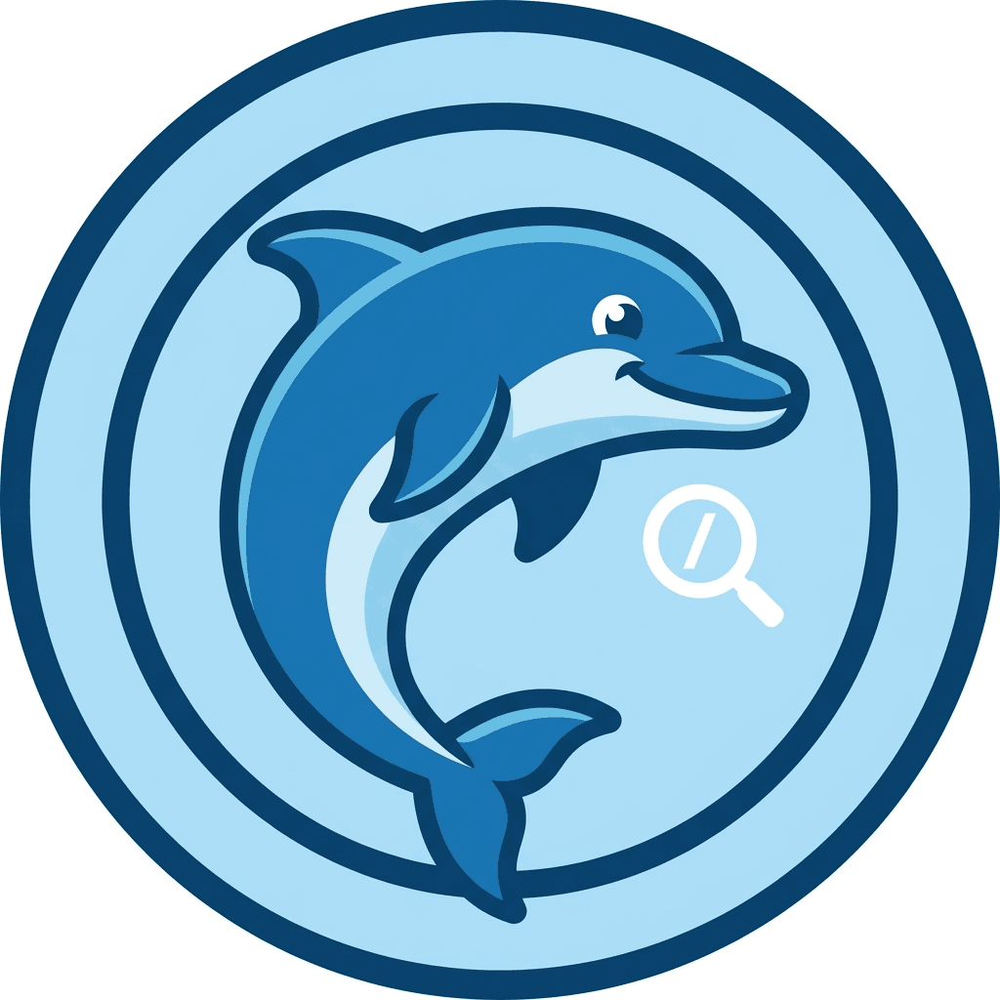

<div align="center">
  

  # ReviewPhin

  **Self-hosted AI code review for GitLab.**
  Run on your own infrastructure. Bring your own model. Use your own agent subscription to pay per review, not per developer.

  [](https://hub.docker.com/r/cdwv/reviewphin)
  [](LICENSE)
</div>

---

ReviewPhin is a hard working dolphin that listens for GitLab merge request comments, runs a multi-agent AI review, and writes findings back as GitLab discussions - while only ever touching content it created itself.

All model calls go through configured harness (currently Copilot CLI, but more may come) so either subscription models, or [OpenAI-compatible API](docs/model-providers.md) can be connected. 

Everything is yours: Storage, Copilot subscription or custom models. **You know what you pay for because it's all yours.**

*Created by [@rgembalik](https://github.com/rgembalik) with support from [CodeWave](https://codewave.eu)*


## Table of Contents

- [How it works](#how-it-works)
- [Quickstart with Docker](#quickstart-with-docker)
- [Kubernetes / Helm](#kubernetes--helm)
- [Adding tenants](#adding-tenants)
- [Using ReviewPhin in GitLab](#using-reviewphin-in-gitlab)
- [Review pipeline](#review-pipeline)
- [Technologies](#technologies)
- [Environment variables](#environment-variables)
- [CLI reference](docs/CLI.md)
- [Model providers](docs/model-providers.md)
- [Code review platform providers](docs/code-review-platform-providers.md)
- [Storage providers](docs/storage-providers.md)

---

## How it works

1. A developer mentions the bot in a GitLab merge request comment (`@reviewphin review this`).
2. ReviewPhin receives the GitLab Note Hook webhook, validates the signature, and queues a job.
3. The **Router** hydrates the merge request: it checks out the exact commit, fetches diffs, notes, and any project instruction files.
4. The **Reviewer** (a two-agent pipeline) analyses the changes and produces structured findings with severity, category, optional line anchors, and inline code suggestions.
5. The **Chatter** handles follow-up replies, conversational questions, and durable project memory updates.
6. Findings are reconciled back into GitLab as bot-owned discussions. Obsolete threads are resolved; the summary note is updated.

All code and data stay on your infrastructure. The worker calls the configured model API and the GitLab API; nothing else leaves the network.

---

## Quickstart with Docker

The published image is `cdwv/reviewphin`. It bundles the GitHub Copilot CLI for default-mode operation and exposes the `reviewphin` CLI entrypoint.

### 1. Configure the worker

Copy the example environment file and fill in your settings:

```bash
cp .env.example .env.docker
```

At minimum, set one GitHub token (for Copilot CLI mode):

```env
GH_TOKEN=github_pat_xxxxxxxxxxxxxxxxxxxxxxxxxxxx
```

If you prefer to configure separate Github api token for different projects, yopu can skip this environment variable and configure [model profiles through CLI](./docs/CLI.md#model-profile-commands). 

See [Environment variables](#environment-variables) and [Model providers](docs/model-providers.md) for full options.

### 2. Start the container

```bash
docker compose up -d
```

The compose file mounts `./data` to `/app/data` (SQLite database + run logs) and `./tmp` to `/app/tmp` (hydrated workspaces). Both directories are created automatically.

### 3. Expose the worker to GitLab

ReviewPhin receives GitLab webhooks over HTTPS. If your GitLab instance cannot reach your host directly, create a temporary tunnel:

```bash
# Using cloudflared (no account needed for one-off tunnels)
cloudflared tunnel --url http://localhost:3000

# Or using ngrok
ngrok http 3000
```

Note the public HTTPS URL; you will use it in the webhook settings.

For production, place ReviewPhin behind a TLS-terminating reverse proxy or use the [Helm chart](#kubernetes--helm).

### 4. Confirm it is running

```bash
curl http://localhost:3000/healthz
# {"status":"ok"}
```

---

## Kubernetes / Helm

A Helm chart is published at `https://charts.cdwv.dev/reviewphin`. It deploys one `Deployment`, one `Service` on port `3000`, and one `PersistentVolumeClaim` for `/app/data` and `/app/tmp`.

```bash
helm repo add cdwv https://charts.cdwv.dev
helm repo update
helm upgrade --install reviewphin cdwv/reviewphin \
  --namespace reviewphin --create-namespace \
  --set env.GH_TOKEN=<your-token>
```

If you prefer to configure separate Github api token for different projects, yopu can skip this environment variable and configure [model profiles through CLI](./docs/CLI.md#model-profile-commands). 

**ToDo: add ingress && gateway API support**

---

## Adding tenants

A **tenant** is a single project on given gitlab instance. One ReviewPhin instance can serve multiple tenants, but each tenant is configured only for one project.

### 1. Create a bot identity in GitLab

Use one of:

- a **project access token** (scoped to one project)
- a **group access token** (scoped to a group)
- a **personal access token** belonging to a dedicated bot user (you must add it to project with at least Developer role)

Required scope: **`api`** - the only scope ReviewPhin uses on the token. It is needed to read merge request data, create/update/resolve bot-owned discussions, and to clone the repository over Git-over-HTTPS during workspace hydration. ReviewPhin never touches content it did not author itself; the `api` scope is used solely for the read/write actions described in [Review pipeline](#review-pipeline).

Required project membership: **Developer or higher** (needed to resolve merge request discussions and read repository contents).

### 2. Find the project ID and bot identity

```bash
# Find the project
curl --header "PRIVATE-TOKEN: <token>" \
  "https://gitlab.example.com/api/v4/projects?search=my-project"

# Get the token's own identity
curl --header "PRIVATE-TOKEN: <token>" \
  "https://gitlab.example.com/api/v4/user"
```

Use the project's `id`, the user's `id` as `--bot-user-id`, and `username` as `--bot-username`.

### 3. Register the tenant with the CLI

#### In a Docker container

```bash
docker compose run --rm worker reviewphin tenant add \
  --base-url https://gitlab.example.com \
  --project-id 123 \
  --api-token glpat-xxxxxxxx \
  --webhook-secret replace-me \
  --bot-user-id 999 \
  --bot-username reviewphin
```

#### From a local checkout

```bash
pnpm cli tenant add \
  --base-url https://gitlab.example.com \
  --project-id 123 \
  --api-token glpat-xxxxxxxx \
  --webhook-secret replace-me \
  --bot-user-id 999 \
  --bot-username reviewphin
```

To assign a specific model profile at registration time, add `--model-profile <name>`. See [Model providers](docs/model-providers.md) for profile setup.

### 4. Add the webhook in GitLab

In the project's **Settings → Webhooks**:

| Field        | Value                                           |
| ------------ | ----------------------------------------------- |
| URL          | `https://your-host/webhooks/gitlab/note`        |
| Secret token | the same value you passed as `--webhook-secret` |
| Trigger      | **Note events** only                            |

Save, then use the **Test** button (select *Note events*) to verify ReviewPhin receives the delivery and returns `200`.

### 5. Verify the tenant is registered

```bash
# Docker
docker compose run --rm worker reviewphin tenant list

# Local
pnpm cli tenant list
```

See [CLI reference](docs/CLI.md) for all tenant and model-profile commands.

---

## Using ReviewPhin in GitLab

> **Note:** The exact bot username depends on how you registered the tenant. The examples below use `@reviewphin`; substitute your own `--bot-username` value.

### Trigger a review

Post a merge request comment that mentions the bot:

```
@reviewphin review this
```

ReviewPhin queues a job, hydrates the merge request, and creates or updates bot-owned discussion threads for each finding plus a summary note at the top of the discussion list.

On first run this is a **full review** covering all changed files. On subsequent runs for the same merge request it is an **incremental re-review** focused on files changed since the last run.

### Force a full re-scan

To ignore the previous review and rescan everything from scratch:

```
@reviewphin full review
```

Other accepted phrasings: `full rescan`, `fresh full review`, `rescan everything`.

### Follow-up conversations

Replies inside a bot-owned review discussion automatically queue a new pass scoped to that thread. You do not need to mention the bot again:

```
# Inside a bot discussion thread:
Can you suggest a more readable variable name here?
```

### Teach the bot project conventions

To store a durable note in the project memory (written to the `ReviewPhin memory` wiki page):

```
@reviewphin for future reference, we always prefer functional React components over class components
```

Other triggers: `remember`, `going forward`, `team policy`, `always prefer`, `please prefer`.

### Override the model for one MR

Add a directive in the merge request **description** (not a comment):

```
/reviewphin-profile byok-gpt4
```

This selects a named model profile for every review run on that MR. To read more about named model profiles, read [about model profile management through CLI](./docs/CLI.md#model-profile-commands)

---

## Review pipeline

ReviewPhin uses three logical components for each triggered review:

### Router

The webhook handler validates the GitLab signature, classifies the trigger (direct mention, follow-up reply, or summary note reply), deduplicates concurrent jobs, and enqueues a review task. No model calls happen here.

### Reviewer

The main agent runs as two sequential subagents inside a single model session:

1. **context-analyst** - explores the hydrated workspace using `glob`, `ripgrep`, and file-read tools to gather the context most relevant to the changed files.
2. **review-author** - produces structured findings: severity, category, body text, optional diff anchor, and optional inline code suggestion.

The reviewer selects one of three modes based on trigger context:
- **first-pass-full** - first review of the MR, or an explicit full rescan
- **incremental-rereview** - focused on files changed since the last review
- **follow-up-thread** - scoped to one existing discussion thread

### Chatter

A lightweight agent that runs after the reviewer (when applicable). It handles:
- conversational replies to questions or wording requests
- project memory decisions (`add_memory_entry` tool writes to the wiki page)
- reply text for explicit follow-up targets

Chatter uses the `textGenerationModel` from the active profile (falling back to the review model when unset), keeping lighter interactions cheaper.

---

## Technologies

| Layer              | Technology                                    |
| ------------------ | --------------------------------------------- |
| Runtime            | Node.js 22, TypeScript 5                      |
| HTTP server        | Fastify 5                                     |
| AI runtime         | `@github/copilot-sdk` (Copilot CLI wrapper)   |
| Model APIs         | native Copilot, vLLM, Azure OpenAI, Anthropic |
| Storage (default)  | SQLite via `better-sqlite3`                   |
| Storage (optional) | Flotiq headless CMS                           |
| Logging            | pino (structured JSON)                        |
| Validation         | zod                                           |
| Packaging          | Docker, multi-stage build                     |
| Orchestration      | Helm (Kubernetes)                             |

---

## Environment variables

All variables are optional unless noted. For local Docker from source, put them in `.env.docker`; for local runs, use `.env`.

| Variable                                             | Default                          | Description                                                                     |
| ---------------------------------------------------- | -------------------------------- | ------------------------------------------------------------------------------- |
| `PORT`                                               | `3000`                           | HTTP port                                                                       |
| `HOST`                                               | `0.0.0.0`                        | Bind address                                                                    |
| `LOG_LEVEL`                                          | `info`                           | `fatal` \| `error` \| `warn` \| `info` \| `debug` \| `trace` \| `silent`        |
| `STORAGE_PROVIDER_MODULE`                            | built-in SQLite                  | Module path or package name for a custom storage adapter                        |
| `SQLITE_DATABASE_PATH`                               | `./data/review-worker.sqlite`    | SQLite file path (ignored when a custom storage module is set)                  |
| `RUN_LOG_DIR`                                        | `./data/run-logs`                | Root directory for per-review run artifacts                                     |
| `WORKSPACE_ROOT`                                     | `./tmp/review-workspaces`        | Scratch directory for hydrated repositories                                     |
| `MAX_JOB_RETRIES`                                    | `3`                              | Retry attempts for failed review jobs                                           |
| `RETRY_BACKOFF_MS`                                   | `5000`                           | Delay (ms) between retries                                                      |
| `COPILOT_TIMEOUT_MS`                                 | `180000`                         | Model session timeout in milliseconds                                           |
| `COPILOT_SDK_LOG_LEVEL`                              | _(none)_                         | SDK log verbosity: `none` \| `error` \| `warning` \| `info` \| `debug` \| `all` |
| `COPILOT_CLI_PATH`                                   | `/usr/local/bin/copilot` (image) | Path to the Copilot CLI binary                                                  |
| `REVIEWPHIN_MEMORY_ENABLED`                          | `true`                           | Enable per-project wiki memory                                                  |
| `REVIEWPHIN_MAX_PROMPT_MEMORY_CHARS`                 | `5000`                           | Character budget for injected project memory                                    |
| `GH_TOKEN` / `GITHUB_TOKEN` / `COPILOT_GITHUB_TOKEN` | _(required for Copilot mode)_    | GitHub PAT with **Copilot Requests** permission                                 |

For model profile setup (BYOK providers, Azure OpenAI, etc.) see [Model providers](docs/model-providers.md).
For custom storage adapters see [Storage providers](docs/storage-providers.md).

---

## Routes

| Method | Path                    | Description                               |
| ------ | ----------------------- | ----------------------------------------- |
| `GET`  | `/healthz`              | Liveness probe, returns `{"status":"ok"}` |
| `POST` | `/webhooks/gitlab/note` | GitLab Note Hook receiver                 |
